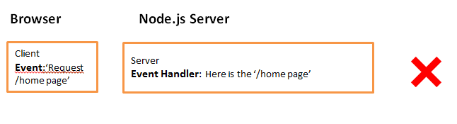

# Events

## What are Events from node.js perspective ?

### This is an event


### This is **not** an event



## Basics of node.js events

 - Events have event emitters and event listeners (also called event handlers)
 - Event listeners have to be registered first to handle any emitted event
 - If there are multiple listeners, all the handlers will be executed in the order they are registered
 - Emitters emit the event and any event data using `event.emit('event-name', data);`
 - Listeners handle the event and fetch data using `event.on('event-name', function(data){});`

### How to implement an EventEmitter

 - Import `EventEmitter` class from `events` module
 - Always **inherit and instantiate** the EventEmitter. Never instantiate the class directly

Javascript implementation

```javascript
/*
	Implementing an Event Emitter
*/
//Get the EventEmitter class
var EventEmitter = require('events').EventEmitter;

var util = require('util');

//Inherit your own event emitter using util's inherits method
function MyEmitter(){
	//This is exclusively MyEmitter's property;
	this.emitter_msg = "MyEmitter's emitter";
	//Copy all the EventEmitter properties to MyEmitter
	EventEmitter.call(this);
}

//Copy the prototype chain of EventEmitter to MyEmitter
util.inherits(MyEmitter, EventEmitter); 	


/*
	Using your emitter
	1. Instantiate your custom emitter
	2. Register a listener using .on
	3. Emit an event using .emit
	NOTE: Check .on is used first before .emit. Try doing it reverse and check
*/
//Instantiate myemitter
var myemitter = new MyEmitter();

//myemitter's property
console.log(myemitter.emitter_msg);


//Handle the event 'message'. 
myemitter.on('message', function(data){
	console.log("Data is:" + data);
})


//EventEmitter's property
console.log(myemitter.eventNames());

//Emit an event 'message'. 
myemitter.emit('message', 'Hello Emitter');
```


ES6 implementation
```javascript
'use strict;'
const EventEmitter = require('events').EventEmitter;

class MyEmitter extends EventEmitter{
	constructor(){
		//Call the super constructor. This has to be the first statement.
		super();
		this.emitter_msg = "ES6 version of MyEmitter";
	}
}

const myemitter = new MyEmitter();

//myemitter's property
console.log(myemitter.emitter_msg);

//Handle the event 'message'. 
myemitter.on('hello', function(data){
	console.log("Hello " + data);
})

//EventEmitter's property
console.log(myemitter.eventNames());

//Emit an event 'message'. 
myemitter.emit('hello', 'World!!!');

```

## Examples
### Multiple Event Listeners - syncrhonously in the order

```javascript
var listener1 = function(data){
	console.log("Listener 1");
	console.log(data);
}

var listener2 = function(data){
	console.log("Listener 2");
	console.log(data);
}

//Listener 2 is registered first
myemitter.on('message', listener2);
myemitter.on('message', listener1);

myemitter.emit('message', "Hello folks!!!");

/*
Output:
Listener 2
Hello folks!!!
Listener 1
Hello folks!!!
*/
```

### Listen to multiple events - Implicit
```javascript
var listener1 = function(data){
	console.log(data);
}

myemitter.on('message', listener1);

myemitter.emit('message', "First Event");
myemitter.emit('message', "Second Event");
/*
Output:
First Event
Second Event
*/
```
### Listen only once - Listener is removed after once listened
```javascript
var listener1 = function(data){
	console.log(data);
}

myemitter.once('message', listener1);

myemitter.emit('message', "First Event");
myemitter.emit('message', "Second Event");
/*
Output:
First Event
*/
```

### Change Listener order - Only prepending to listener array is possible
```javascript
var listener1 = function(data){
	console.log("Execute a function for the event " + data);
}
var listener2 = function(data){
	console.log("Authenticate " + data);
}

//Registered First.
myemitter.on('message', listener1);
//Registered later but prepended to the start of the array. So executed first
myemitter.prependListener('message', listener2);

myemitter.emit('message', "My Event");
/*
Output:
Authenticate My Event
Execute a function for the event My Event
*/
```

### Set max Listeners - If more listeners are present, a warning is thrown but they're still executed
```javascript
var listener1 = function(data){
	console.log("First listener for the event " + data);
}
var listener2 = function(data){
	console.log("Second listener for the event " + data);
}
var listener3 = function(data){
	console.log("Third listener for the event " + data);
}

//Setting one listner as max;
myemitter.setMaxListeners(1);

myemitter.on('message', listener1);
myemitter.on('message', listener2);
myemitter.on('message', listener3);

myemitter.emit('message', "My Event");
/*
Output:
First listener for the event My Event
Second listener for the event My Event
Third listener for the event My Event
(node:7600) Warning: Possible EventEmitter memory leak detected. 2 message listeners added. Use emitter.setMaxListeners() to increase limit
*/
```

## API Reference

[Events](https://nodejs.org/api/events.html)