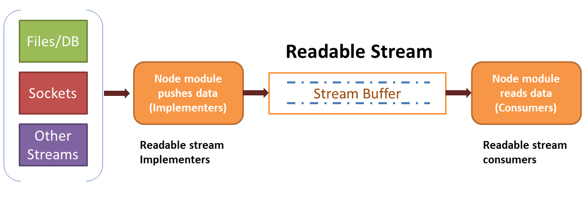
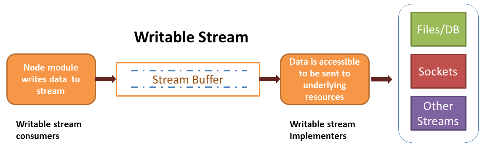

# Streams

## What are streams in node.js ?

Stream is nothing but flowing data
 
 - The data can be of any datatype. Widely used are `Buffer` and `string`. `null` is never used
 - APIs that consume the stream are called stream consumers
 - APIs that implement (provide interface) to the stream are called stream implementers
 - All streams are instances of Event Emitters
 - Every action on a stream or every state of stream is represented by an event
 - Actions on streams trigger events (`.emit`). But we don't need to `emit` any events while implementing the stream. It is abstracted.
 - State of streams is handled by event listeners (`.on`). We may choose to implement `on` handler methods to act on an event or we can use some abstracted methods provided by node stream module


##Types of streams

 - Readable streams from which data can be read
 - Writable streams to which data can be written
 - Duplex streams. These are both readable and writable
 - Transform streams. These are duplex streams where we can transform data before it is consumed






## Readable streams

Though not common, for understanding, here we first implement the streams and show the examples of consuming the streams

In real life, a stream is implemented in limited but consumed widely

### Implement a readble stream

1. Inherit from Readable calss of 'stream' module
2. Instantiate the readables stream
3. Implement `_read` function (never execute) on the readable stream instance or class
4. push the data within `_read()` using `push` method
5. push `null` to signify end of the readable stream
6. Whenever the stream is ready with _read

Below example is an implementation of Readable stream. 
When you run this code, nothing happens as the stream always begin in paused mode and is not activated unless consumers attempt to read or handle data listeners on it.
We'll understand more about modes of Readable stream in the "Consuming Readable Stream" section

```javascript
var Readable = require('stream').Readable;
var util = require('util');

function MyReadable(data_array){
	Readable.call(this);
	this.data_array = data_array;
}

util.inherits(MyReadable, Readable)


MyReadable.prototype._read = function(){
	for (var each_data of this.data_array){
		console.log('pushing' + each_data);
		this.push(each_data);
	}
	this.push(null);
}

var rs = new MyReadable(['Hello!!!', 'This', 'is', 'a', 'critical', 'problem']);

```


### Consume a readble stream

In the above example, we've implemented readable stream but `push` is never invoked as the stream started in paused mode

Modes of Readable stream:	

1. Paused mode
2. Flowing mode

NOTES:

 - Readable Stream by default starts in `paused` mode. Data is still not in node's buffer (could be on heap or stack or with the buffer of underlying resource)
 - Once the stream is enabled to be in `flowing` mode, node starts streaming the data out to the consumer. At any case, data is never buffered at node's level
 - Stream can be **turned to flowing mode** using 3 ways
 	- `rstream.on('data')` - data event listener since streams are also events. We'll see what events in further examples
 	- `rstream.resume()` - Resumes the stream into flowing mode from paused mode
 	- `rstream.pipe(writable)` - pipe into a writable stream
 - If any of the above 3 methods are invoked, stream turns into flowing mode and data is started pushing from the stream implementer.
 - In paused mode, we have to explicitly call the below method to read the data
 	- `rstream.read(size)` - read a 'size'ed chunk of data 

#### Flowing mode using rstream.on('data')

 - Each push of data from implementer results in a `data` event
 - push of null results in an `end` event

```javascript
/* Paste the above 'Stream Implementer code' here */

//Each push of data results in a data event
rs.on('data',function(data){		
	console.log('Read: ' + data.toString('utf8'));;
})

//push of null results in an end event
rs.on('end',function(){
	console.log("Stream ended");
})	

/*
Output:
Pushing: Hello!!!
Pushing: This    
Pushing: is      
Pushing: a       
Pushing: critical
Pushing: problem 
Read: Hello!!!   
Read: This       
Read: is         
Read: a          
Read: critical   
Read: problem    
Stream ended     
*/

```

#### Flowing mode using rstream.resume()

- Resume the stream using `.resume()`
- Attach data listeners after 5 seconds 
- When resume is invoked, stream turned into flowing mode and stream starts pushing the data
- Since the data listeners are not attached till 5 seconds, we'll not receive the data
- This proves that node doesn't buffer the data at its level. It just let the data flow.

```javascript
/* Paste the above 'Stream Implementer code' here */

//Resume the readable stream so that implementer starts pushing the data
rs.resume();
console.log('Turned into flowing mode');

setTimeout(function() {
    //Each push of data results in a data event
    rs.on('data', function(data) {
        console.log('Read: ' + data.toString('utf8'));;
    })
    console.log("Invoked after 5 seconds but no data received");

}, 5000);

//push of null results in an end event
rs.on('end', function() {
    console.log("Stream ended");
});


/*
Output:
Turned into flowing mode
Pushing: Hello!!!       
Pushing: This           
Pushing: is             
Pushing: a              
Pushing: critical       
Pushing: problem        
Stream ended            
Invoked after 5 seconds but no data received 
*/


```

#### Flowing mode using rstream.pipe(writable)

- Resume the stream using `.pipe` method.
- Pipe the data pushed on to the readable stream into a writable stream
- This is the safest way of streaming large datasets. We'll see how

##### Dangerous way of consuming readstream
 - Suppose `['Hello!!!', 'This', 'is', 'a', 'critical', 'problem']` is a large token array of words from a 25GB file and we want to stream to another system (may be a http response or on to the console). We may be quickly tempted to do the following way.
 	- Buffer the pushed data onto a local variable and 
 	- write it to a file at the end or put it onto the console
 	- Here the buffer will be insufficient to handle
 - Other problem is that the destination may not ready to pick the data, the same rate at which it is being pushed into the stream (obviously reading data from a file is faster than sending data over internet connection)


```javascript
/* Paste the above 'Stream Implementer code' here */

var rec_data = '';
//Each push of data results in a data event
rs.on('data',function(data){		
	rec_data = rec_data + data.toString('utf8') + " ";
});

//push of null results in an end event
rs.on('end',function(){
	console.log("Stream ended");
	console.log("Data received is: " + rec_data);
});	

/*
Pushing: Hello!!!
Pushing: This
Pushing: is
Pushing: a
Pushing: critical
Pushing: problem
Stream ended
Data received is: Hello!!! This is a critical problem
*/

```

##### Correct way of consuming readstream

For the above stated proble,s `.pipe()` comes to the rescue.

```javascript
/* Paste the above 'Stream Implementer code' here */

//from the readable stream rs, pipe the data to the console's stdout (attached to process global object)
rs.pipe(process.stdout);

/*
Output:
Pushing: Hello!!!             
Pushing: This                 
Pushing: is                   
Pushing: a                    
Pushing: critical             
Pushing: problem              
Hello!!!Thisisacriticalproblem
*/

```